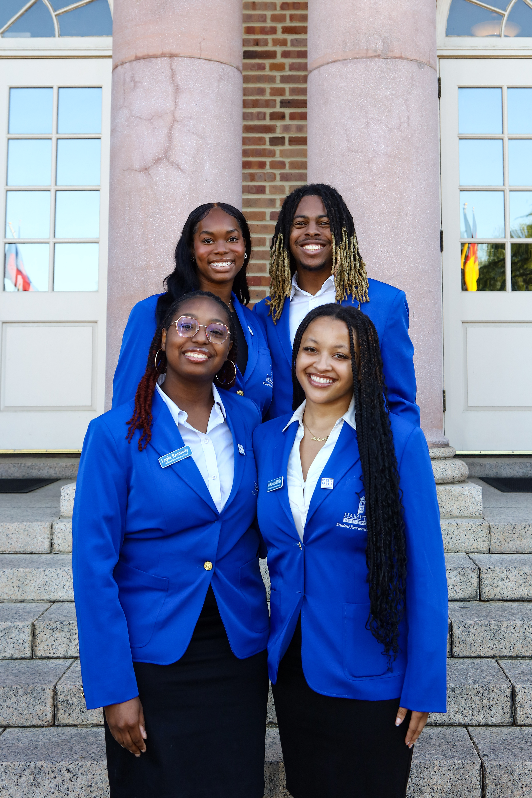
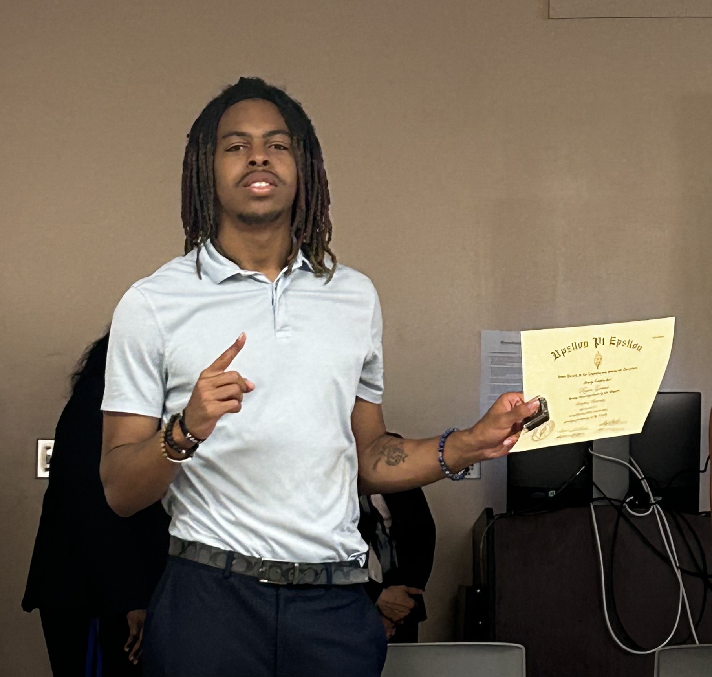

# rygrimes1.github.io
<section>
  <h1>Ryan K. Grimes</h1>
  

    <a href="#about">About Me</a>
    | <a href="#education">Education</a>
    | <a href="#experience">Experience</a>
    | <a href="#certifications">Certifications</a>
  

</section>
<a href="https://www.linkedin.com/in/iamryang/">Add Me on LinkedIn</a>

<section id="about">
<h2>About Me</h2>

  My name is Ryan Grimes, and I am a
graduating senior majoring in cybersecurity at
Hampton University with a strong interest in coding,
digital forensics, and risk management. My
academic journey has been shaped by hands-on
coursework, national competitions, and research
opportunities that have sharpened my technical
abilities and critical thinking skills. Proficient in JavaScript and skilled in Unix, Python and SQL, my academic background and passion for cybersecurity position me as a
valuable candidate. Eager to apply my skills in a real-world setting, I bring a strong work ethic and effective problem-solving
abilities. I look forward to contributing to a dynamic team and discussing how my enthusiasm aligns with my team’s goals.

<section id="education">
<h2>Education</h2>

  Bachelor of Science Degree (September 2022 – May 2026)  

  Hampton University, Hampton, VA – Cyber Security (Computer Science Track)  

   Cumulative GPA: 3.44  

  Relevant Coursework:  
  Computer Programming I and II, Discrete Structures, Data Structures I and II, Computer Organization I and II, Psychology, Terrorism & National Security Management, DatabaseManagement Systems, Digital Forensics, Laws; Ethics; and Policy of Cyberspace, and Risk Management.
  

<section id="experience">
  <h2>Experience</h2>
    
  <h3>Project Hackathon</h3>
  
January 2022

  
Tasked with creating randomly assigned programs using Scratch and Javascript in a randomly selected group under a
  time-limit. Aforementioned program had to be explained using a visual and oral presentation then demonstrated to a board of
  judges. 

  
  <h3>Peer Tutor</h3>
  
September 2023 - Present

  
In collaboration with the Hampton University Computer Science Department, I provide tutoring in Computer
  Programming courses with a focus in Javascript programming. 

  
  <h3>Toyota Leadership Academy</h3>
  
December 2023 - May 2024

  
Responsible for developing learning plans for high school students that actively engages them into the computer
  science career field while additionally providing mentor counsel.

  
  <h3>Upsilon Pi Epsilon</h3>
  
January 2024- Present

  
Upsilon Pi Epsilon also known as the International Computer Science Honors Society. To be a member one must be a
  computer science major and maintain a 3.2 or higher GPA.

  
  <h3>Student Recruitment Team, Team Leader, Spirit and Special Events Committee</h3>
  
January 2024- Present

  
Organized and led recruitment events to promote school spirit and engage prospective students.

  
  <h3>Leidos Pirates Quest Capture the Flag</h3>
  
October 2024

  
Placed 14th in a cybersecurity competition with 100 competitors, tackling challenges in cryptography, hardware, DNS,
  command-line interface, and source code injection.

  
  <h3>ADMI Capture the Flag Competition</h3>
  
March 2025

  
Competed in cybersecurity Capture the Flag challenges, applying problem-solving and technical skills in cryptography,
  reverse engineering, and network analysis and placed 4th.

  
  <h3>Men’s Caucus, Event Planning Committee</h3>
  
March 2025 - Present

  
Collaborated with team members to organize campus events focused on empowerment, leadership, and community
  engagement for male students.

  
  <h3>SGX3 Coding Institute</h3>
  
June 2025

  
Selected for an intensive summer program focused on software development, research, and scientific gateways,
  working in teams under faculty and industry mentorship.

<section id="certifications">
  <h2>Certifications</h2>
    
  <h3>Google Cybersecurity Specialist (2024)</h3>
  
Google Career Certificates

  
  <h3>COMPTIA Security+ (2024)</h3>
  
COMPTIA

  
  <h3>SQL and Relational Databases 101 (2025)</h3>
  
IBM’s Cognitive Class

  
  <h3>Big Data 101 (2025)</h3>
  
IBM’s Cognitive Class

  
  <h3>NoSQL and DBaaS 1001 (2025)</h3>
  
IBM’s Cognitive Class

  
  <h3>Accessing Hadoop Data Using Hive (2025)</h3>
  
IBM’s Cognitive Class

  
  <h3>Terminal, Bash & VIM Essentials</h3>
  
Amigoscode

  
  <h3>Git & Github Fundamentals</h3>
  
Amigoscode

  
  <h3>Spring Boot for Beginners</h3>
  
Amigoscode

